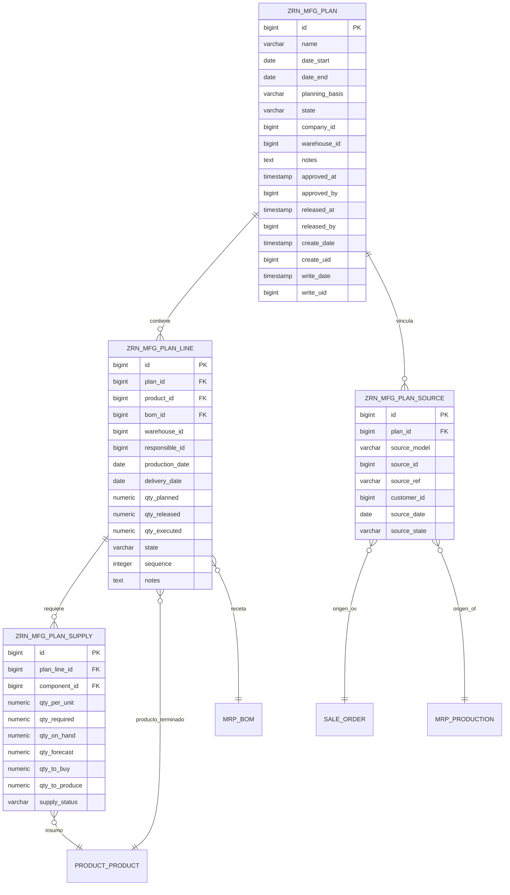

# ZRN Prodigyn

## Control de librerias de graficas

Para el Hub Comercial se manejaran dos caminos de graficas:

- Graficas nativas de Odoo cuando el caso sea simple y el widget ya resuelva bien la necesidad.
- Graficas con libreria JS externa cuando Odoo nativo no cubra el tipo de visualizacion o limite demasiado el layout del dashboard.

### Graficas nativas de Odoo

Se mantiene el uso de `widget="dashboard_graph"` para casos sencillos como:

- linea o area simple
- barras verticales simples
- comparativos rapidos dentro del formulario

Esto evita dependencias innecesarias cuando Odoo ya resuelve bien el caso.

### Libreria externa aprobada

La libreria autorizada para las graficas no cubiertas por Odoo nativo sera:

- `Apache ECharts`

### Motivo de eleccion

Se elige `Apache ECharts` porque permite cubrir en una sola libreria los tipos que se necesitan en el resumen comercial sin forzar hacks visuales:

- barras horizontales reales
- barras apiladas
- donut / pie
- scatter / burbujas
- heatmap calendario
- pareto 80/20
- combinaciones de series en un mismo lienzo

Adicionalmente:

- funciona bien en dashboards administrativos
- permite configuraciones sobrias alineadas con Odoo
- evita mezclar varias librerias para distintos tipos de grafica
- da control suficiente para datos comerciales agregados

### Regla de uso en este addon

- Si la grafica se puede resolver con `dashboard_graph` sin perder claridad, se deja nativa de Odoo.
- Si requiere barras horizontales, heatmap, donut, scatter, pareto o varias series combinadas, se implementa con `Apache ECharts`.
- No se deben introducir varias librerias de graficas en paralelo para el mismo submodulo salvo decision documentada aqui.

### Alcance inicial para Hub Comercial

Graficas que pueden seguir nativas:

- `Venta diaria, pedidos diarios, unidades`
- `Venta total, pedidos, unidades`

Graficas que migraran a `Apache ECharts`:

- `Top clientes, top PDVs, top productos`
- `Venta por canal y producto`
- `Clientes, PDVs, productos`
- `Venta diaria, pedidos, actividad`
- `Venta por canal o categoria`
- `Ticket promedio vs pedidos vs venta`

### Estado actual

- `dashboard_graph` ya se usa en el resumen comercial para algunas visualizaciones simples.
- `Apache ECharts` queda aprobado y documentado en este archivo como libreria externa para la siguiente fase de implementacion.
- Mientras no se integre en assets y JS del addon, no debe asumirse como activa en produccion.

## Marcas comerciales

Para la nueva capa de marcas comerciales se dejo documentacion tecnica separada en:

- `docs/db/commercial_brands_schema.sql`
- `docs/db/commercial_brands_er.md`

La estructura base contempla:

- una tabla madre para la marca comercial
- una tabla puente para asignar productos vendibles de Odoo
- unicidad por producto para evitar que un mismo producto quede ligado a dos marcas

## Planeacion desacoplada de ejecucion

Para evitar que una orden de fabricacion creada con anticipacion reserve o afecte inventario antes de tiempo, la recomendacion es no usar `mrp.production` como tabla de planeacion.

La idea es separar:

- `Planeacion de fabricacion`
- `Planeacion de compra de insumos`
- `Ejecucion real en Odoo`

Con esto el usuario puede planear una semana completa:

- que producto fabricar
- que dia producirlo
- para que fecha debe estar listo
- que insumos se requieren
- que cantidad hace falta comprar

Y solo cuando el plan se libera, se generan las OF reales o las compras reales.

---

## Nombres propuestos de tablas

Para que sean mas identificables y sirvan tanto para fabricacion como para abastecimiento, estos nombres son mas claros:

- `zrn_plan_batch`
  Cabecera del plan semanal o del rango.
- `zrn_plan_batch_line`
  Lineas del plan de produccion por producto y fecha.
- `zrn_plan_batch_supply`
  Explosion de insumos de cada linea del plan.
- `zrn_plan_batch_source`
  Trazabilidad del plan contra OVs, OFs u otra demanda.

Si se quiere hacer todavia mas explicito por area:

- `zrn_mfg_plan`
- `zrn_mfg_plan_line`
- `zrn_mfg_plan_supply`
- `zrn_mfg_plan_source`

En este documento usare la segunda opcion porque comunica mejor que es planeacion de manufactura, aunque funcionalmente tambien soporta abastecimiento.

---

## Rol de cada tabla

### `zrn_mfg_plan`

Cabecera del planning.

Guarda:

- semana o rango planeado
- base de planeacion
- estado del plan
- bodega
- notas
- aprobacion / liberacion

### `zrn_mfg_plan_line`

Cada producto planeado para fabricarse.

Guarda:

- producto terminado
- receta/BOM usada
- fecha de produccion
- fecha objetivo de entrega
- cantidad planeada
- cantidad liberada
- cantidad ejecutada

### `zrn_mfg_plan_supply`

Explosion de insumos por cada linea planeada.

Guarda:

- insumo
- cantidad requerida
- stock actual
- stock proyectado
- cantidad a comprar
- cantidad a producir internamente

### `zrn_mfg_plan_source`

Trazabilidad del por que existe el plan.

Guarda:

- documento origen
- modelo origen
- referencia
- cliente / punto de venta
- fecha origen
- estado origen

---

## Diagrama ER



---

## SQL de PostgreSQL

Este SQL no es para correrse manualmente si luego el addon va a crear los modelos con ORM. Sirve como referencia exacta de la estructura que se espera en base de datos.

```sql
CREATE TABLE IF NOT EXISTS zrn_mfg_plan (
    id BIGSERIAL PRIMARY KEY,
    name VARCHAR(255) NOT NULL,
    date_start DATE,
    date_end DATE,
    planning_basis VARCHAR(32) NOT NULL DEFAULT 'sale',
    state VARCHAR(32) NOT NULL DEFAULT 'draft',
    company_id BIGINT REFERENCES res_company(id) ON DELETE SET NULL,
    warehouse_id BIGINT REFERENCES stock_warehouse(id) ON DELETE SET NULL,
    notes TEXT,
    approved_at TIMESTAMP,
    approved_by BIGINT REFERENCES res_users(id) ON DELETE SET NULL,
    released_at TIMESTAMP,
    released_by BIGINT REFERENCES res_users(id) ON DELETE SET NULL,
    create_uid BIGINT REFERENCES res_users(id) ON DELETE SET NULL,
    create_date TIMESTAMP,
    write_uid BIGINT REFERENCES res_users(id) ON DELETE SET NULL,
    write_date TIMESTAMP
);

CREATE INDEX IF NOT EXISTS idx_zrn_mfg_plan_state
    ON zrn_mfg_plan(state);

CREATE INDEX IF NOT EXISTS idx_zrn_mfg_plan_basis
    ON zrn_mfg_plan(planning_basis);

CREATE INDEX IF NOT EXISTS idx_zrn_mfg_plan_dates
    ON zrn_mfg_plan(date_start, date_end);


CREATE TABLE IF NOT EXISTS zrn_mfg_plan_line (
    id BIGSERIAL PRIMARY KEY,
    plan_id BIGINT NOT NULL REFERENCES zrn_mfg_plan(id) ON DELETE CASCADE,
    product_id BIGINT NOT NULL REFERENCES product_product(id) ON DELETE RESTRICT,
    bom_id BIGINT REFERENCES mrp_bom(id) ON DELETE SET NULL,
    warehouse_id BIGINT REFERENCES stock_warehouse(id) ON DELETE SET NULL,
    responsible_id BIGINT REFERENCES res_users(id) ON DELETE SET NULL,
    production_date DATE NOT NULL,
    delivery_date DATE,
    qty_planned NUMERIC(16, 4) NOT NULL DEFAULT 0,
    qty_released NUMERIC(16, 4) NOT NULL DEFAULT 0,
    qty_executed NUMERIC(16, 4) NOT NULL DEFAULT 0,
    state VARCHAR(32) NOT NULL DEFAULT 'draft',
    sequence INTEGER NOT NULL DEFAULT 10,
    notes TEXT,
    create_uid BIGINT REFERENCES res_users(id) ON DELETE SET NULL,
    create_date TIMESTAMP,
    write_uid BIGINT REFERENCES res_users(id) ON DELETE SET NULL,
    write_date TIMESTAMP
);

CREATE INDEX IF NOT EXISTS idx_zrn_mfg_plan_line_plan
    ON zrn_mfg_plan_line(plan_id);

CREATE INDEX IF NOT EXISTS idx_zrn_mfg_plan_line_product
    ON zrn_mfg_plan_line(product_id);

CREATE INDEX IF NOT EXISTS idx_zrn_mfg_plan_line_dates
    ON zrn_mfg_plan_line(production_date, delivery_date);

CREATE INDEX IF NOT EXISTS idx_zrn_mfg_plan_line_state
    ON zrn_mfg_plan_line(state);


CREATE TABLE IF NOT EXISTS zrn_mfg_plan_supply (
    id BIGSERIAL PRIMARY KEY,
    plan_line_id BIGINT NOT NULL REFERENCES zrn_mfg_plan_line(id) ON DELETE CASCADE,
    component_id BIGINT NOT NULL REFERENCES product_product(id) ON DELETE RESTRICT,
    qty_per_unit NUMERIC(16, 4) NOT NULL DEFAULT 0,
    qty_required NUMERIC(16, 4) NOT NULL DEFAULT 0,
    qty_on_hand NUMERIC(16, 4) NOT NULL DEFAULT 0,
    qty_forecast NUMERIC(16, 4) NOT NULL DEFAULT 0,
    qty_to_buy NUMERIC(16, 4) NOT NULL DEFAULT 0,
    qty_to_produce NUMERIC(16, 4) NOT NULL DEFAULT 0,
    supply_status VARCHAR(32) NOT NULL DEFAULT 'pending',
    create_uid BIGINT REFERENCES res_users(id) ON DELETE SET NULL,
    create_date TIMESTAMP,
    write_uid BIGINT REFERENCES res_users(id) ON DELETE SET NULL,
    write_date TIMESTAMP
);

CREATE INDEX IF NOT EXISTS idx_zrn_mfg_plan_supply_line
    ON zrn_mfg_plan_supply(plan_line_id);

CREATE INDEX IF NOT EXISTS idx_zrn_mfg_plan_supply_component
    ON zrn_mfg_plan_supply(component_id);

CREATE INDEX IF NOT EXISTS idx_zrn_mfg_plan_supply_status
    ON zrn_mfg_plan_supply(supply_status);


CREATE TABLE IF NOT EXISTS zrn_mfg_plan_source (
    id BIGSERIAL PRIMARY KEY,
    plan_id BIGINT NOT NULL REFERENCES zrn_mfg_plan(id) ON DELETE CASCADE,
    source_model VARCHAR(64) NOT NULL,
    source_id BIGINT NOT NULL,
    source_ref VARCHAR(255),
    customer_id BIGINT REFERENCES res_partner(id) ON DELETE SET NULL,
    source_date DATE,
    source_state VARCHAR(32),
    create_uid BIGINT REFERENCES res_users(id) ON DELETE SET NULL,
    create_date TIMESTAMP,
    write_uid BIGINT REFERENCES res_users(id) ON DELETE SET NULL,
    write_date TIMESTAMP
);

CREATE INDEX IF NOT EXISTS idx_zrn_mfg_plan_source_plan
    ON zrn_mfg_plan_source(plan_id);

CREATE INDEX IF NOT EXISTS idx_zrn_mfg_plan_source_model_id
    ON zrn_mfg_plan_source(source_model, source_id);

CREATE INDEX IF NOT EXISTS idx_zrn_mfg_plan_source_customer
    ON zrn_mfg_plan_source(customer_id);
```

---

## Equivalencia ORM Odoo

Si estas tablas se crean por addon, lo correcto es no ejecutar SQL manual sino declarar modelos Odoo con estos `_name`:

- `zrn.mfg.plan`
- `zrn.mfg.plan.line`
- `zrn.mfg.plan.supply`
- `zrn.mfg.plan.source`

O si queremos mantener el prefijo actual del addon:

- `zrn_prodigyn.mfg.plan`
- `zrn_prodigyn.mfg.plan.line`
- `zrn_prodigyn.mfg.plan.supply`
- `zrn_prodigyn.mfg.plan.source`

En PostgreSQL, Odoo normalmente crearia tablas asi:

- `zrn_prodigyn_mfg_plan`
- `zrn_prodigyn_mfg_plan_line`
- `zrn_prodigyn_mfg_plan_supply`
- `zrn_prodigyn_mfg_plan_source`

Esta opcion es la mas recomendable si el plan va a ser gestionado desde UI, permisos, chatter, acciones, filtros y reportes.

---

## Estados recomendados

### Cabecera del plan

- `draft`
- `approved`
- `released`
- `done`
- `cancel`

### Lineas del plan

- `draft`
- `ready`
- `released`
- `in_progress`
- `done`
- `cancel`

### Estado de abastecimiento

- `pending`
- `covered_stock`
- `to_buy`
- `to_produce`
- `mixed`

---

## Flujo funcional esperado

1. El usuario filtra la demanda desde OVs o desde OFs.
2. El sistema crea una cabecera `zrn_mfg_plan`.
3. Se generan lineas `zrn_mfg_plan_line` por producto y fecha.
4. Se explotan insumos en `zrn_mfg_plan_supply`.
5. Se registra trazabilidad en `zrn_mfg_plan_source`.
6. Compras trabaja sobre los insumos requeridos.
7. Produccion trabaja sobre las lineas liberadas.
8. Solo al liberar se generan OF reales o compras reales.

---

## Ventaja de esta arquitectura

La ventaja principal es que el planning deja de tocar inventario antes de tiempo.

`mrp.production` queda solo para ejecucion real.

Estas tablas nuevas quedan como una capa de planeacion:

- mas segura
- mas trazable
- mas flexible para semanas futuras
- mas util para fabricacion y compras al mismo tiempo

---

## Recomendacion final

Si esto se va a desarrollar dentro del addon, la mejor ruta es:

1. Crear estos 4 modelos en ORM Odoo.
2. No usar SQL manual en produccion.
3. Usar el SQL de este documento solo como referencia tecnica.
4. Hacer que `Planeacion de fabricacion` y `Planeacion de abastecimiento` lean y escriban sobre estas tablas.
5. Generar OFs reales solo desde una accion tipo `Liberar plan`.
